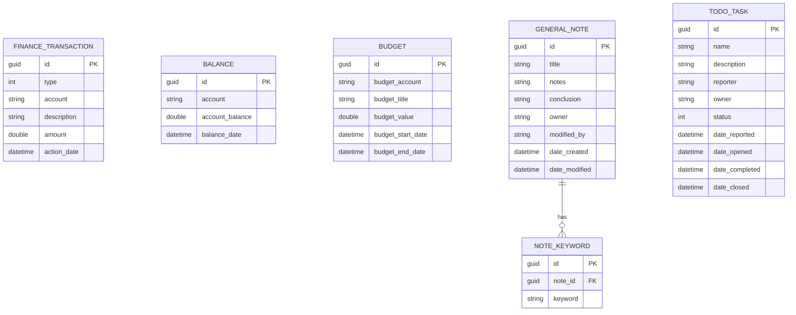

# Database Architecture

This document describes the database schema for the myDashBoard application. The system is designed to use a relational database (PostgreSQL/MySQL) to store data for all three backend services.

## ER Diagram

## Schema Definitions

### 1. Finance Service Tables

#### FINANCE_TRANSACTION
Stores individual financial transactions.
- `id`: GUID, Primary Key.
- `type`: Integer (Enum: 0=UNDEFINED, 1=DEPOSIT, 2=WITHDRAWAL, 3=LOAN, 4=SAVE).
- `account`: String, the account number/IBAN.
- `description`: String, transaction details.
- `amount`: Double, the monetary value.
- `action_date`: DateTime, when the transaction occurred.

#### BALANCE
Stores the current balance for accounts.
- `id`: GUID, Primary Key.
- `account`: String, unique identifier for the account.
- `account_balance`: Double, current amount in the account.
- `balance_date`: DateTime, timestamp of the balance record.

#### BUDGET
Stores budget targets for accounts.
- `id`: GUID, Primary Key.
- `budget_account`: String, the account this budget applies to.
- `budget_title`: String, name of the budget.
- `budget_value`: Double, the target amount.
- `budget_start_date`: DateTime, start of the budget period.
- `budget_end_date`: DateTime, end of the budget period.

### 2. Notes Service Tables

#### GENERAL_NOTE
Stores general user notes.
- `id`: GUID, Primary Key.
- `title`: String, title of the note.
- `notes`: Text, main content of the note.
- `conclusion`: Text, summary or conclusion.
- `owner`: String, user who created the note.
- `modified_by`: String, last user to modify.
- `date_created`: DateTime, creation timestamp.
- `date_modified`: DateTime, last modification timestamp.

#### NOTE_KEYWORD
Stores keywords associated with notes (One-to-Many).
- `id`: GUID, Primary Key.
- `note_id`: GUID, Foreign Key to `GENERAL_NOTE(id)`.
- `keyword`: String, tag for searching.

### 3. Todo Service Tables

#### TODO_TASK
Stores tasks and their statuses.
- `id`: GUID, Primary Key.
- `name`: String, name of the task.
- `description`: Text, task details.
- `reporter`: String, user who reported the task.
- `owner`: String, user assigned to the task.
- `status`: Integer (Enum: 0=UNDEFINED, 1=OPEN, 2=PROGRESS, 3=DONE, 4=DEPRECATED, 5=CLOSED).
- `date_reported`: DateTime.
- `date_opened`: DateTime.
- `date_completed`: DateTime.
- `date_closed`: DateTime.
